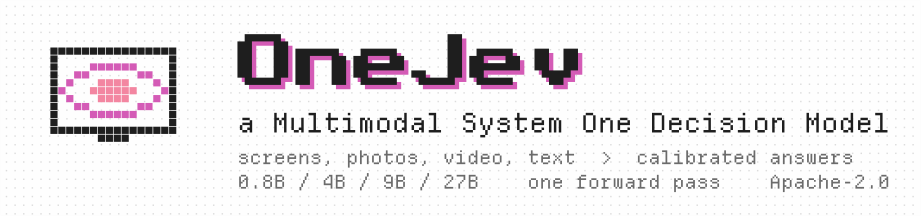
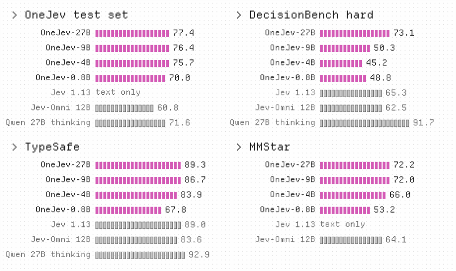
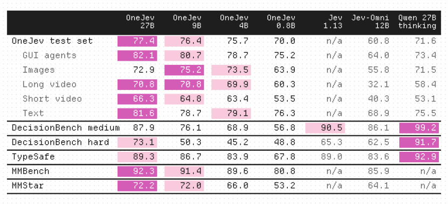
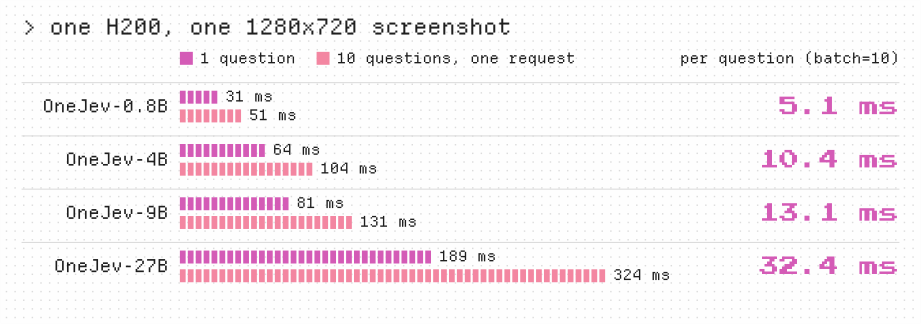

<p align="center">
  <picture>
    <source media="(prefers-color-scheme: dark)" srcset="assets/banner-dark.svg">
    
  </picture>
</p>

<p align="center">
  <a href="https://huggingface.co/OmniJev/OneJev"></a>
  <a href="https://github.com/OmniJev/OneJev"></a>
  <a href="https://omnijev.github.io/OneJev/"></a>
  <a href="#api"></a>
  <a href="LICENSE"></a>
</p>
<p align="center">
  <a href="https://www.python.org"></a>
  <a href="https://pytorch.org"></a>
  <a href="https://github.com/huggingface/transformers"></a>
</p>

We propose OneJev, a multimodal System One decision model. Give it a screenshot, a photo, a video or plain text
along with a few typed questions, and it returns a calibrated probability for every option of every question in a
single forward pass. It speaks TypeSafe's System One API, extended with images and video, and comes in four sizes,
all trained on the same 99,193 questions drawn from real agent runs, videos and images.

## Results

<p align="center">
  <picture>
    <source media="(prefers-color-scheme: dark)" srcset="assets/results-dark.svg">
    
  </picture>
</p>

<p align="center">
  <picture>
    <source media="(prefers-color-scheme: dark)" srcset="assets/table-dark.svg">
    
  </picture>
</p>

Scores are accuracy in percent. The OneJev test set is questions from the same kinds of data as training that the
models never saw during training. Jev 1.13's scores are its published ones, and it reads text only. We ran Jev-Omni
and Qwen3.8-27B thinking on the same questions; the thinking model writes a few thousand words of reasoning before each
answer, OneJev answers directly.

<p align="center">
  <picture>
    <source media="(prefers-color-scheme: dark)" srcset="assets/speed-dark.svg">
    
  </picture>
</p>

## Quick start

```bash
pip install git+https://github.com/OmniJev/OneJev.git
qev serve --model OmniJev/OneJev/4B --port 8000
```

```python
from qev import Client, Choice, Noul, Score
from qev.media import data_uri

r = Client("http://localhost:8000").system_one(
    state={"task": "Pay the open invoice from ACME", "screen": "<image:1>"},
    media=[{"type": "image", "data": data_uri("screenshot.png")}],
    questions={"done": Noul("The invoice has been paid"),
               "next": Choice("What should the agent do next?",
                              {"click": "click an element", "type": "type text", "scroll": "scroll", "stop": "stop"}),
               "progress": Score("How far along is the task?", ["not started", "halfway", "almost done", "done"])},
)
r.answers["done"].noul                  # probability of yes
r.answers["next"].probabilities         # one probability per option
r.answers["progress"].score             # expected level
```

Text-only requests are plain System One requests; the official `typesafe-sdk` works with
`TYPESAFE_BASE_URL=http://localhost:8000`.

## How it works

The state is read once, with its images and video frames, and every question runs as a short branch off that one
read. The answer is the probability of each option letter at the last position. Ten questions about one screen cost
little more than one.

## API

`POST /v1/systemone` takes TypeSafe's request plus an optional `media` list; the state points at each item as
`<image:N>` or `<video:N>`.

```text
image   {"type": "image", "url": ...}   {"type": "image", "data": <base64>}   {"type": "image", "path": ...}
video   {"type": "video", "frames": [<image>, ...], "fps": 2.0}
```

## Training

Full-parameter fine-tuning of Qwen3.5-0.8B, Qwen3.5-4B, Qwen3.5-9B and Qwen3.8-27B for one epoch, vision tower frozen.


## License

[Apache 2.0](LICENSE)
