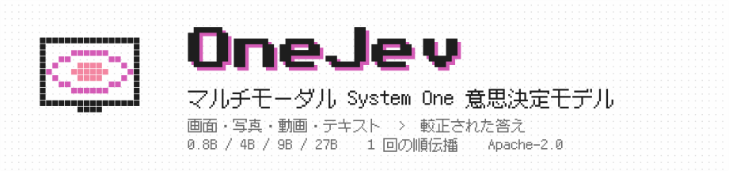
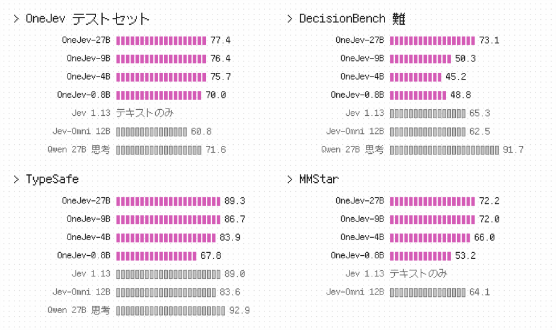
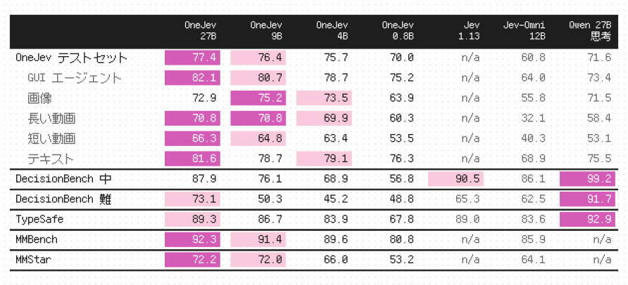
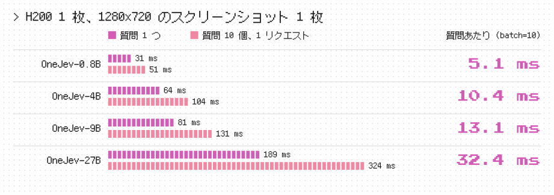

<p align="center">
  <picture>
    <source media="(prefers-color-scheme: dark)" srcset="ja/banner-dark.svg">
    
  </picture>
</p>

<p align="center"><a href="https://github.com/OmniJev/OneJev">English</a> · <a href="README_zh.md">简体中文</a> · <b>日本語</b></p>

<p align="center">
  <a href="https://huggingface.co/collections/OmniJev/onejev"></a>
  <a href="https://huggingface.co/spaces/BradNLP/OneJev"></a>
  <a href="https://github.com/OmniJev/OneJev"></a>
  <a href="https://omnijev.github.io/OneJev/"></a>
  <a href="../LICENSE"></a>
</p>
<p align="center">
  <a href="https://huggingface.co/datasets/OmniJev/OneJev-Data"></a>
  <a href="../examples/request.json"></a>
  <a href="https://www.python.org"></a>
  <a href="https://pytorch.org"></a>
  <a href="https://github.com/huggingface/transformers"></a>
</p>

OneJev はマルチモーダルな System One 意思決定モデルです。スクリーンショット、写真、動画、テキストに関する型付きの質問に、1 回の順伝播で較正済みの確率を返します。サイズは 0.8B、4B、9B、27B の 4 種類です。

## 結果

<p align="center">
  <picture>
    <source media="(prefers-color-scheme: dark)" srcset="ja/results-dark.svg">
    
  </picture>
</p>

<p align="center">
  <picture>
    <source media="(prefers-color-scheme: dark)" srcset="ja/table-dark.svg">
    
  </picture>
</p>

正解率（%）。OneJev テストセットは OneJev の学習には使用していません。Jev 1.13 は公開のテキスト評価スコア、Jev-Omni と Qwen3.8-27B 思考モードは私たちによる評価です。

<p align="center">
  <picture>
    <source media="(prefers-color-scheme: dark)" srcset="ja/speed-dark.svg">
    
  </picture>
</p>

## クイックスタート

どちらかのバックエンドを起動し、下の Python サンプルを実行してください。

### 選択肢 A：PyTorch

NVIDIA GPU 向け。テキスト、画像、動画に対応しています。

```bash
pip install "qev[torch] @ git+https://github.com/OmniJev/OneJev.git"
qev serve --model OmniJev/OneJev-4B --port 8000
```

### 選択肢 B：llama.cpp

GGUF モデル向け。テキストと画像に対応し、動画には PyTorch を使います。まず [llama.cpp](https://github.com/ggml-org/llama.cpp/blob/master/docs/install.md) をインストールしてください（macOS では `brew install llama.cpp`）。

```bash
pip install git+https://github.com/OmniJev/OneJev.git
qev serve --gguf mradermacher/OneJev-4B-GGUF:Q8_0 --port 8000
```

### リクエストを送る

どちらのバックエンドも `http://localhost:8000` で同じ API を提供します。別のターミナルで、自分の `screenshot.png` を使ってサンプルを実行してください：

```python
from qev import Client, Choice, Noul, Score
from qev.media import data_uri

r = Client("http://localhost:8000").system_one(
    state={"task": "Pay the open invoice from ACME", "screen": "<image:1>"},
    media=[{"type": "image", "data": data_uri("screenshot.png")}],
    questions={"done": Noul("The invoice has been paid"),
               "next": Choice("What should the agent do next?",
                              {"click": "click an element", "type": "type text", "scroll": "scroll", "stop": "stop"}),
               "progress": Score("How far along is the task?", ["not started", "halfway", "almost done", "done"])},
)
r.answers["done"].noul                  # 「はい」の確率
r.answers["next"].probabilities         # 選択肢ごとの確率
r.answers["progress"].score             # 期待レベル
```

API は TypeSafe System One と互換です。その他の例：[動画](../examples/video.py)、[curl](../examples/curl.sh)、[公式 TypeSafe SDK](../examples/official_sdk.py)。

## 学習

```bash
git clone https://github.com/OmniJev/OneJev.git
cd OneJev
pip install -e ".[train]"

# A・B のどちらかを選択。以下では A が有効です。
# A. デモ：画像付き 100 件（23 MB）
hf download OmniJev/OneJev-Data sample/sample-100.parquet --repo-type dataset --local-dir data/onejev
python -m train.unpack data/onejev --sample

# B. 全データ：94,707 件（17.7 GB）。B を使う場合は次の 2 行のコメントを外し、A を省いてください。
# hf download OmniJev/OneJev-Data --repo-type dataset --include "data/*.parquet" --local-dir data/onejev
# python -m train.unpack data/onejev
```

どちらを選んでも `data/onejev/train.jsonl` が作成され、画像と動画フレームは `data/onejev/media/` に展開されます。

[OneJev-Data](https://huggingface.co/datasets/OmniJev/OneJev-Data) は元の学習データ 99,193 問のうち 94,707 問を公開しています。残りは元データの再配布が許可されていません。

### ファインチューニング

4 モデルはそれぞれ Qwen3.5-0.8B、Qwen3.5-4B、Qwen3.5-9B、Qwen3.8-27B をベースに、ビジョンタワーを固定して 1 エポック学習します。設定は学習率 `5e-6`、最大 16,384 トークンで、回答の確率に対する交差エントロピーと Brier 損失を使います。4B を GPU 4 枚で学習するには：

```bash
torchrun --nproc-per-node 4 -m train.sft --config train/configs/onejev_4b_full.yaml
```

設定：[0.8B](../train/configs/onejev_08b_full.yaml) · [4B](../train/configs/onejev_4b_full.yaml) · [9B](../train/configs/onejev_9b_full.yaml) · [27B](../train/configs/onejev_27b_full.yaml)。`--nproc-per-node` を GPU の枚数に合わせてください。9B と 27B は FSDP でモデルとオプティマイザーの状態を分割します。独自のデータを使う場合は、設定の `train` と `media_root` を変更します。

4B の最終モデルは `train/runs/onejev_4b/final` に保存されます。次のコマンドで起動できます：

```bash
qev serve --model train/runs/onejev_4b/final --port 8000
```

## 引用

```bibtex
@misc{onejev2026,
  title        = {{OneJev}: A Multimodal System One Decision Model},
  author       = {{OmniJev Team}},
  year         = {2026},
  howpublished = {\url{https://github.com/OmniJev/OneJev}}
}
```

## Friendly Links

- [LINUX DO](https://linux.do)
- [Jev](https://typesafe.ai)
- [Awesome JEV](https://github.com/OmniJev/awesome-jev-gallery)
- [Awesome JEV Website](https://omnijev.github.io/awesome-jev-gallery/)
- [PlayJev](https://github.com/OmniJev/PlayJev)

## ライセンス

[Apache 2.0](../LICENSE)
