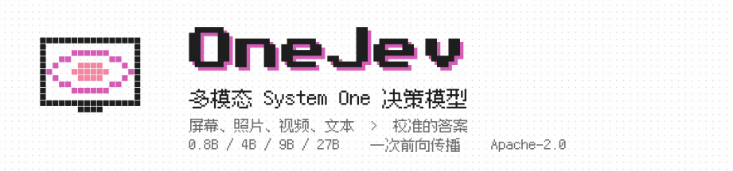
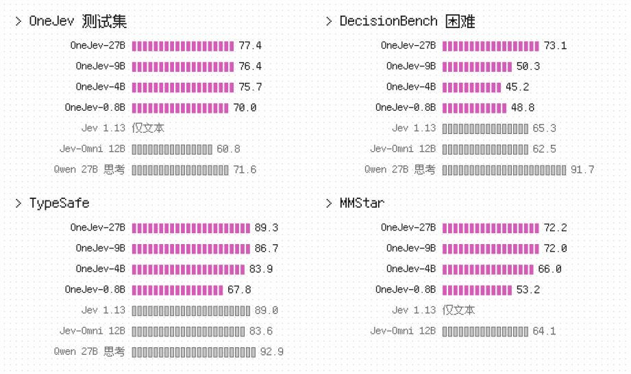
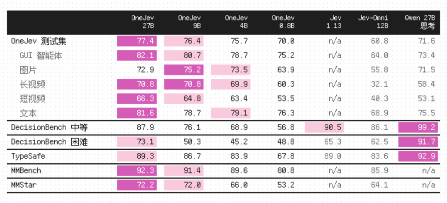
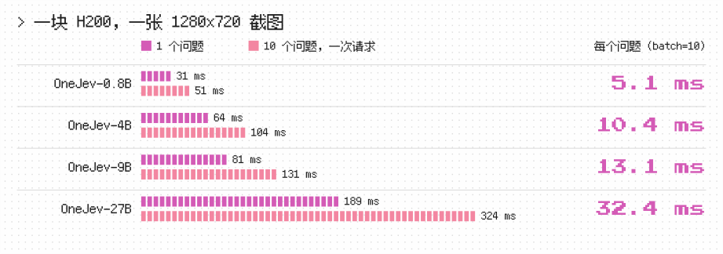

<p align="center">
  <picture>
    <source media="(prefers-color-scheme: dark)" srcset="zh/banner-dark.svg">
    
  </picture>
</p>

<p align="center"><a href="https://github.com/OmniJev/OneJev">English</a> · <b>简体中文</b> · <a href="README_ja.md">日本語</a></p>

<p align="center">
  <a href="https://huggingface.co/collections/OmniJev/onejev"></a>
  <a href="https://huggingface.co/spaces/BradNLP/OneJev"></a>
  <a href="https://github.com/OmniJev/OneJev"></a>
  <a href="https://omnijev.github.io/OneJev/"></a>
  <a href="../LICENSE"></a>
</p>
<p align="center">
  <a href="https://huggingface.co/datasets/OmniJev/OneJev-Data"></a>
  <a href="../examples/request.json"></a>
  <a href="https://www.python.org"></a>
  <a href="https://pytorch.org"></a>
  <a href="https://github.com/huggingface/transformers"></a>
</p>

OneJev 是一个多模态 System One 决策模型，一次前向传播即可为截图、照片、视频和文本上的带类型问题返回校准后的概率，提供 0.8B、4B、9B 和 27B 四种尺寸。

## 结果

<p align="center">
  <picture>
    <source media="(prefers-color-scheme: dark)" srcset="zh/results-dark.svg">
    
  </picture>
</p>

<p align="center">
  <picture>
    <source media="(prefers-color-scheme: dark)" srcset="zh/table-dark.svg">
    
  </picture>
</p>

准确率（%）。OneJev 测试集未参与 OneJev 训练。Jev 1.13 使用公开的纯文本评测分数；Jev-Omni 和 Qwen3.8-27B 思考模式由我们评测。

<p align="center">
  <picture>
    <source media="(prefers-color-scheme: dark)" srcset="zh/speed-dark.svg">
    
  </picture>
</p>

## 快速开始

任选一种后端启动，再运行下面的 Python 示例。

### 选项 A：PyTorch

适用于 NVIDIA GPU，支持文本、图片和视频。

```bash
pip install "qev[torch] @ git+https://github.com/OmniJev/OneJev.git"
qev serve --model OmniJev/OneJev-4B --port 8000
```

### 选项 B：llama.cpp

使用 GGUF 模型，支持文本和图片；视频使用 PyTorch。先安装 [llama.cpp](https://github.com/ggml-org/llama.cpp/blob/master/docs/install.md)（macOS 可运行 `brew install llama.cpp`）。

```bash
pip install git+https://github.com/OmniJev/OneJev.git
qev serve --gguf mradermacher/OneJev-4B-GGUF:Q8_0 --port 8000
```

### 发起请求

两种后端都在 `http://localhost:8000` 提供相同接口。在另一个终端中，用你自己的 `screenshot.png` 运行示例：

```python
from qev import Client, Choice, Noul, Score
from qev.media import data_uri

r = Client("http://localhost:8000").system_one(
    state={"任务": "支付 ACME 的待付款发票", "屏幕": "<image:1>"},
    media=[{"type": "image", "data": data_uri("screenshot.png")}],
    questions={
        "完成状态": Noul("发票已付款"),
        "下一步": Choice("智能体下一步应该做什么？",
                       {"点击": "点击界面元素", "输入": "输入文字", "滚动": "滚动页面", "停止": "停止操作"}),
        "任务进度": Score("任务完成到哪一步了？", ["尚未开始", "完成一半", "即将完成", "已完成"]),
    },
)
r.answers["完成状态"].noul               # “是”的概率
r.answers["下一步"].probabilities        # 每个选项一个概率
r.answers["任务进度"].score              # 期望等级
```

接口兼容 TypeSafe System One。更多示例：[视频](../examples/video.py)、[curl](../examples/curl.sh)、[官方 TypeSafe SDK](../examples/official_sdk.py)。

## 训练

**体验示例数据：**[预览 100 条样本](https://huggingface.co/datasets/OmniJev/OneJev-Data/blob/main/sample/sample-100-preview.json) · [下载含图片版本（23 MB）](https://huggingface.co/datasets/OmniJev/OneJev-Data/resolve/main/sample/sample-100.parquet)。

### 准备数据

[OneJev-Data](https://huggingface.co/datasets/OmniJev/OneJev-Data) 公开了 99,193 道训练题中的 94,707 道，其余来源不允许再分发。下载并解包：

```bash
git clone https://github.com/OmniJev/OneJev.git
cd OneJev
pip install -e ".[train]"
hf download OmniJev/OneJev-Data --repo-type dataset --include "data/*.parquet" --local-dir data/onejev
python -m train.unpack data/onejev
```

解包后得到 `data/onejev/train.jsonl`，图片和视频帧存放在 `data/onejev/media/`。

### 微调

四个模型分别基于 Qwen3.5-0.8B、Qwen3.5-4B、Qwen3.5-9B 和 Qwen3.8-27B，冻结视觉塔，微调一轮。配置使用 `5e-6` 学习率、16,384 token 长度上限，对答案概率计算交叉熵和 Brier 损失。在四张 GPU 上训练 4B 模型：

```bash
torchrun --nproc-per-node 4 -m train.sft --config train/configs/onejev_4b_full.yaml
```

配置：[0.8B](../train/configs/onejev_08b_full.yaml) · [4B](../train/configs/onejev_4b_full.yaml) · [9B](../train/configs/onejev_9b_full.yaml) · [27B](../train/configs/onejev_27b_full.yaml)。将 `--nproc-per-node` 设为 GPU 数量；9B 和 27B 配置启用 FSDP，分片存储模型与优化器状态。使用自有数据时，修改配置中的 `train` 和 `media_root`。

4B 的最终模型保存在 `train/runs/onejev_4b/final`，可直接启动：

```bash
qev serve --model train/runs/onejev_4b/final --port 8000
```

## 引用

```bibtex
@misc{onejev2026,
  title        = {{OneJev}: A Multimodal System One Decision Model},
  author       = {{OmniJev Team}},
  year         = {2026},
  howpublished = {\url{https://github.com/OmniJev/OneJev}}
}
```

## Friendly Links

- [LINUX DO](https://linux.do)
- [Jev](https://typesafe.ai)
- [Awesome JEV](https://github.com/OmniJev/awesome-jev-gallery)
- [Awesome JEV Website](https://omnijev.github.io/awesome-jev-gallery/)
- [PlayJev](https://github.com/OmniJev/PlayJev)

## 许可证

[Apache 2.0](../LICENSE)
